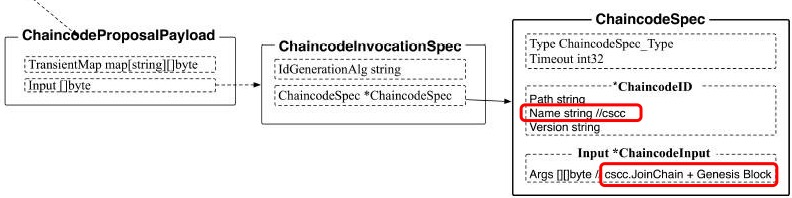

## 加入通道

### 客户端发起请求

应用程序通过SDK或者命令行给节点发送包含通道创世区块的JoinChain请求，在BYFN使用的命令如下:

```shell
peer channel join -b mychannel.block
```

请求的类型 HeaderType_CONFIG, 客户端首先创建一个ChaincodeSpec结构，其input中的Args第一个参数是CSCC.JoinChain（指定调用配置链码的操作），第二个参数为所加入通道的初始区块, 如下图



利用ChaincodeSpec,构造ChaincodeInvocationSpec, 然后创建Proposal接管, 最后客户端通过gRPC(/protos.Endorser/ProcessProposa)把这个Proposal签名后发送给peer节点.


### Peer 接收Proposal

节点加入链的JoinChain请求是由系统链码CSCC处理的:

```go
block, err := utils.GetBlockFromBlockBytes(args[1])
func (e *PeerConfiger) Invoke(stub shim.ChaincodeStubInterface) pb.Response {
	//args[0]为JoinChain或GetChannels
	args := stub.GetArgs()
	fname := string(args[0]) //Invoke function
	sp, err := stub.GetSignedProposal() //获取SignedProposal

	switch fname {
	case JoinChain: //加入通道
		//从args[1]里获取创世区块, 
		block, err := utils.GetBlockFromBlockBytes(args[1])
        // 获取chainID
		cid, err := utils.GetChainIDFromBlock(block)
        // 验证区块内容
		err := validateConfigBlock(block)
        // 检查本地的 MSP Admins 策略
		err = e.policyChecker.CheckPolicyNoChannel(mgmt.Admins, sp)
        // 加入Chain
		return joinChain(cid, block)
	............
	}
}
//代码在core/scc/cscc/configure.go

```


### 合法性和权限检查

由下面两个函数完成

```go
    // 验证区块内容
	err := validateConfigBlock(block) //代码在core/scc/cscc/configure.go
    // 检查本地的 MSP Admins 策略
	err = e.policyChecker.CheckPolicyNoChannel(mgmt.Admins, sp)//代码在core/policy/policy.go

```

它们会校验创世区块的合法性（包括内容完整性），比如是否包含应用相关的配置项，还会对提交者的身份进行认证和权限检查.

配置交易是需要应用程序用提交者的私钥进行签名的，身份认证需要确认请求Header是否包含有效的提交者身份信息，再验证配置交易请求是否是该提交者签名的。

然后是权限检查，包括两个方面。

1）是否有权限向节点提交请求：即检查提交者的MSP是否与本地MSP相同。

2）是否满足加入通道请求的策略：提交加入通道请求是需要有管理员权限的.


### 加入Chain

```go
func joinChain(chainID string, block *common.Block) pb.Response {
    //建mychannel的链（账本）和gossip服务
	err := peer.CreateChainFromBlock(block)
    //初始化Chain
	peer.InitChain(chainID)
    // 发送创建区块的event
	err := producer.SendProducerBlockEvent(block)
	return shim.Success(nil)
}
//代码在core/scc/cscc/configure.go
```

创建peer结点 mychannel的Chain 账本和gossip服务

```go
func CreateChainFromBlock(cb *common.Block) error {
    // 从block中获取chainIID
    cid, err := utils.GetChainIDFromBlock(cb)
    var l ledger.PeerLedger
    // 根据区块创建属于mychannel的账本
    l, err = ledgermgmt.CreateLedger(cb)
	// 创建新的Chain, 初始化Gossip服务, 并与Orderer连接.
    return createChain(cid, l, cb)
}
```

### 返回结果

从Peer节点的joinChain返回后, 客户端会收到ProposalResp, 整个join工作结束.