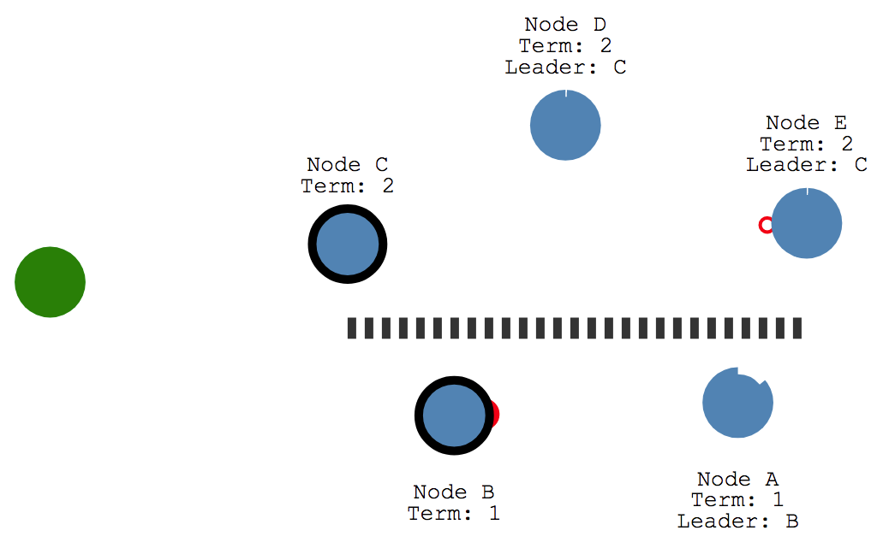
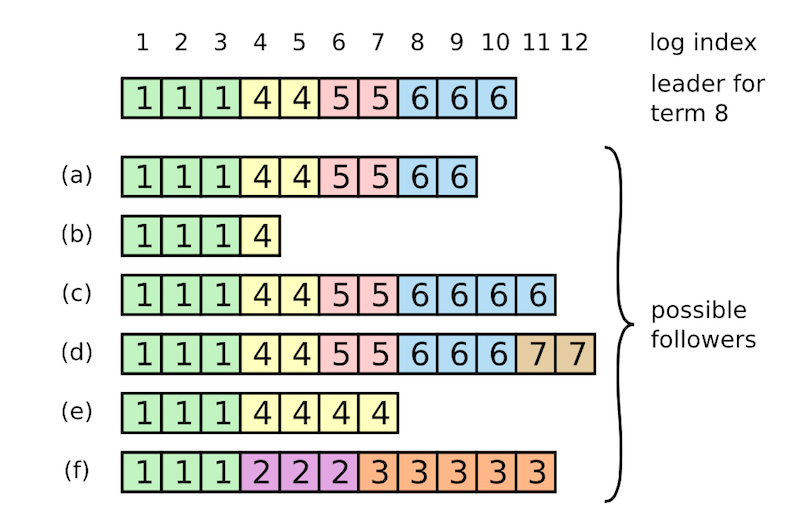

## 共识算法 - Raft

Raft 是一种用来管理日志复制的一致性算法。它和 Paxos 的性能和功能是一样的，但是它和 Paxos 的结构不一样；这使得 Raft 更容易理解并且更容易实现。这里的更容易理解仅是相对于Paxos, 那么Raft是如何做到的呢?  Raft 将一致性算法分为了几个部分:

- 领导选取（Leader election）
- 日志复制（Log replication）
- 安全性（Safety)

### 领导选取 - Leader election

Raft内部有一个状态机, 每个节点有三种状态: Leader, Candidate, Follower.

这里需要先介绍一个概念, 任期(Trem),  term 相当于一个逻辑时钟, 标识先后顺序, 用于检测过时的信息.根据状态机, 选举的过程如下:

1. 节点刚启动时, 状态都是Follower.  在一定时间内收到来自Leader或是Candidate的合法RPC请求, 会继续保持Follower, 重置timer.
2. 如果在一定的时间没有收到合法RPC, 开始转化成Candidate, 等待时间一般是150ms-300ms中的一个**随机**值, 称为election timeout.
3. 节点转化成Candidate后, Term先加1, 然后投票给自己, 发送Request Vote给所有节点. 可能会出现下面的情况:
   1. 收到大多数服务器的投票, 成为Leader
   2. 在成为Leader前, 收到另外一个Leader的消息, 选举失败
   3. 超时还没有成为Leader, 可能是出现平票的情况, 重1开始做(因为election timer的时间是随机的, 所以总能选出Leader)

这里有几个隐藏的结论:

1. 因为要收集大多数的节点投票才能成为Leader, 所以一个Term里只有一个Leader.
2. 如果Candidate收到别的Leader的消息, 并且Term并不小于自己, Cadidate会变回Follower
3. Follower会先相应先收到的合法Request Vote, 当同时有两个Candidate出现时是有可能出现平票的, 但因为超时时间是随机值, 重做总能选出Leader.

Raft也可以处理网络分区的情况的, 看个例子:

有A B C D E, 五个节点, 在出现分区前,  B是Leader, 出现分区后, A&B一组, C&D$E一组, B继续保存Leader身份.C D E在收不到Leader发送的心跳后, 开始进入选举, 例子中C变成了Leader, Term为2.

分区计算后, B会收到C发来的RPC, 因为C的Term别自己的大, 认定自己过期, 选C为Leader.

### Log replication

当Leader选出后, 就到了发送Log的环节了.

举一个简单的例子. 

- 客户端发送X=8给Leader, Leader把它作为一个条目加入自己的Log中, 同时保存Term值和在这个条目在这个Term里面的Index. 

- 把log通过AppendEntries发给follower, 只有大多数follower, ACK Leader, Leader才会commit, 并把commit发给follower, follwer才会完成commit .

- 如果leader发送的log没有得到大多数的ack ,这些会处于uncommit. 

这是一个二次提交的过程, 但是分布式网络是复杂的, 真实的情况要比这复杂的多.但是保证Follower和Leader的日志顺序和内容相同, 就能保证一致性.

Raft维护了两个属性来保证Follower和Leader的日志顺序和内容完全相同.

- 如果两个entry在不同的服务器中，拥有同样的index和term，则保证他们保存了相同的命令
- 如果两个entry在不同的服务器中，拥有同样的index和term，则保证在两个entry之前的所有entry都相等。

第二个是在Folower每次收到AppendEntries的时候进行检查, Leader 发送AppendEntries时会带上, Leader内上一个entry的index和term, Follower拿它们和自己本地的prevIndex和prevTerm进行对比, 如果就代表Follower和Leader的Log在之前就不不一样了,需要从不一样的地方, 开始copy, 所以本次就会拒绝AppendEntries.这就是Follower的一致性检查.

如何做到上面提到的属性2呢? 让Leader维护一个nextIndex数组，例如nextIndex[i]用来保存下个发给Follower[i]的Index，如果一致性检测通过，则nextIndex[i]++，不然的话则nextIndex[i]--，直到双方同步log位置。这个感觉有点类似于tcp传数据时的ack，总是返回下一个期望收到的数据包。

这里要注意到, Leader是不会修改自己的log的, 都是让Follower自己修改.

## Safety

Raft针对Leader的选举加了一些限制, 如果不加这个限制, 就会出现覆盖的问题.

在Request Vote中加上Candidate的最后一个entry的index以及term。Follower会与自己的最后一个entry的index和term进行比较。假设term不相等，那么只有拥有最新term的Candidate才能获得选票。若假设term相等，则比较index，最长的那个获得选票。 所以Follower收到Request Vote会等一段时间.

也就是说只有一个Candidate包含了大多数节点全部已经commit的entry的情况下，才能获得选票。这就是所谓的at least up-to-date，其实也就是保证term最新，若term相同，则保证log最长。这样选出来的leader肯定包含所有commit的entry. 

如果没有这个限制, 在上图中如果Leader挂掉, Follower(f)当选, nextIndex会一直uncheck到index=4的entry, 2发给每个follower, 但是4 已经被大多数节点commit了, 这时候就发生了已经commit的entry被覆盖了.

