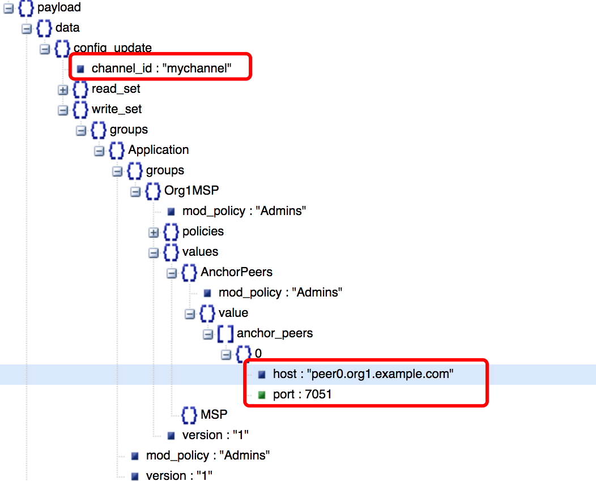

## 锚节点更新

### 锚节点用于跨组织的Gossip通信.

生成锚节点更新的命令:
```
configtxgen -profile TwoOrgsChannel -outputAnchorPeersUpdate ./channel-artifacts/Org1MSPanchors.tx -channelID $CHANNEL_NAME -asOrg Org1MSP
configtxgen -profile TwoOrgsChannel -outputAnchorPeersUpdate ./channel-artifacts/Org2MSPanchors.tx -channelID $CHANNEL_NAME -asOrg Org2MSP
```
对应的log:
```
#################################################################
#######    Generating anchor peer update for Org1MSP   ##########
#################################################################
2018-03-19 15:34:18.323 CST [common/configtx/tool] main -> INFO 001 Loading configuration
2018-03-19 15:34:18.335 CST [common/configtx/tool] doOutputAnchorPeersUpdate -> INFO 002 Generating anchor peer update
2018-03-19 15:34:18.336 CST [common/configtx/tool] doOutputAnchorPeersUpdate -> INFO 003 Writing anchor peer update

#################################################################
#######    Generating anchor peer update for Org2MSP   ##########
#################################################################
2018-03-19 15:34:18.380 CST [common/configtx/tool] main -> INFO 001 Loading configuration
2018-03-19 15:34:18.386 CST [common/configtx/tool] doOutputAnchorPeersUpdate -> INFO 002 Generating anchor peer update
2018-03-19 15:34:18.386 CST [common/configtx/tool] doOutputAnchorPeersUpdate -> INFO 003 Writing anchor peer update
```
通过configtxlator 可以解析, 锚节点更新里面的内容:
```shell
curl -X POST --data-binary @channel-artifacts/Org1MSPanchors.tx http://127.0.0.1:7059/protolator/decode/common.Envelope
```

### 里面有什么?
如图, 它是一个config update, 主要用来修改锚节点地址和端口.

