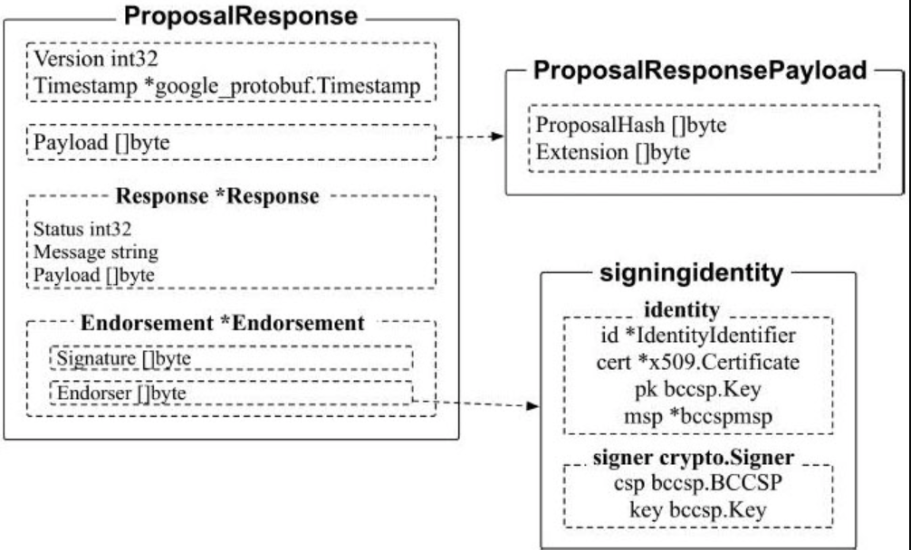

## 背书管理系统链码(ESCC)


交易背书系统链码(ESCC)的全称是Endorsement SystemChaincode, 主要功能是对交易进行结果的结构转换和签名背书.


### ProposalResponse




- Version：int32类型，记录消息协议的版本号信息； 


- Timestamp*google_protobuf.Timestamp类型，记录消息创建的时间

*  Payload：ProposalResponsePayload类型，记录背书提案的Hash值, 读写集.
*  Endorsement：*Endorsement类型，记录背书信息
   *  Signature=Endorser.Sign(ProposalResponsePayload+Endorser)
   *  Endorser 背书者的信息

### 代码

```go
func (e *EndorserOneValidSignature) Invoke(stub shim.ChaincodeStubInterface) pb.Response {
	
	args := stub.GetArgs()
	..................
	// result记录了模拟的result 读写集
	var results []byte
	results = args[5]

    // 获取本地的MSP的默认ID, 用于对Proposal response签名
	localMsp := mspmgmt.GetLocalMSP()
	signingEndorser, err := localMsp.GetDefaultSigningIdentity()

	// 根据参数, 签名信息等 创建proposal response
	presp, err := utils.CreateProposalResponse(hdr, payl, response, results, events, ccid, visibility, signingEndorser)
	// 不清楚为什么这边create后, Marshal 然后再Unmarshal
	prBytes, err := utils.GetBytesProposalResponse(presp)
	pResp, err := utils.GetProposalResponse(prBytes)

}
// 代码在core/scc/escc/endorser_onevalidsignature.go
```

