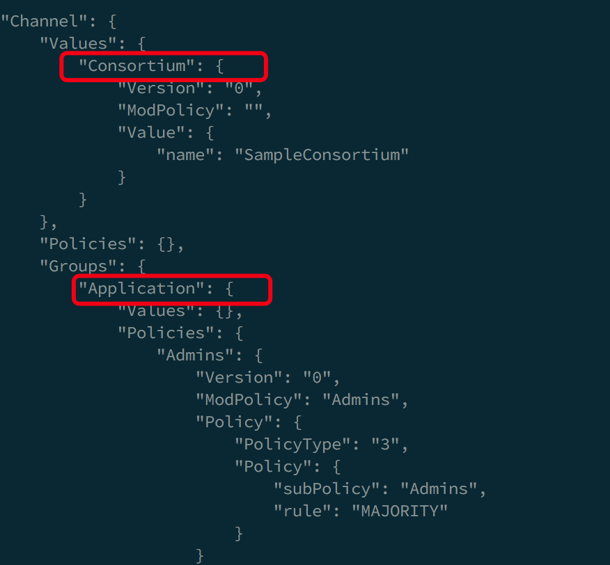

### 配置交易(Configuration TX)

由于区块链系统是的分布式的，对配置进行更新是一件很有挑战的任务, 易出现不同节点之间配置不一致的问题，导致整个网络功能异常. 

在Fabric网络中，通过采用配置交易（ConfigurationTransaction，ConfigTX）来实现对通道相关配置的更新。配置更新操作如果被执行，也会像交易一样经过网络中节点的共识确认。简单说就是把配置更新,像交易一样处理.

生成配置交易的命令:
```
configtxgen -profile  TwoOrgsChannel -outputCreateChannelTx ./channel-artifacts/channel.tx -channelID $CHANNEL_NAME
```
对应的log:
```
#################################################################
### Generating channel configuration transaction 'channel.tx' ###
#################################################################
2018-03-19 15:34:18.274 CST [common/configtx/tool] main -> INFO 001 Loading configuration
2018-03-19 15:34:18.279 CST [common/configtx/tool] doOutputChannelCreateTx -> INFO 002 Generating new channel configtx
2018-03-19 15:34:18.279 CST [common/configtx/tool] doOutputChannelCreateTx -> INFO 003 Writing new channel tx
```

配置交易里面又有什么?
使用命令:
```shell
configtxgen -profile TwoOrgsChannel -inspectChannelCreateTx channel-artifacts/channel.tx
```
 

它为应用通道指定了Application、Consortium信息：   
- Consortium：该应用通道所关联联盟的名称。
- Application：通道的组织信息, 策略等 
> 图中的例子是, Admins的策略是IMPLICIT_META, 规则是MAJORITY, 需要这个联盟里面大多数的管理员签名,认可.

### 为什么不放在创世区块里面?
创世区块里主要是系统通道的配置.
