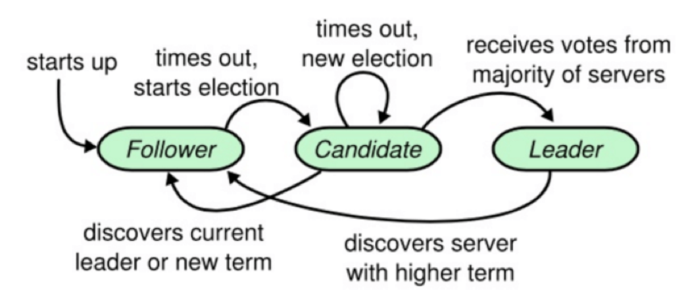
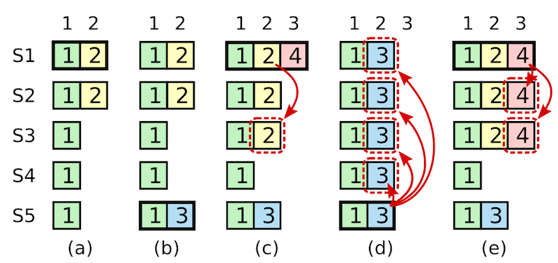

## 共识算法 - Raft

Raft 是一种用来管理日志复制的一致性算法.它和 Paxos 的性能和功能是一样的,但是它和 Paxos 的结构不一样；这使得 Raft 更容易理解并且更容易实现.这里的更容易理解仅是相对于Paxos, 那么Raft是如何做到的呢?  Raft 将一致性算法分为了几个部分:

- 领导选取 (Leader election) 
- 日志复制 (Log replication) 
- 安全性 (Safety)

### 领导选取 - Leader election

Raft内部有一个状态机, 每个节点有三种状态: Leader, Candidate, Follower.

这里需要先介绍一个概念, 任期(Trem),  term 相当于一个逻辑时钟, 标识先后顺序, 用于检测过时的信息.根据状态机, 选举的过程如下:

1. 节点刚启动时, 状态都是Follower.  在一定时间内收到来自Leader或是Candidate的合法RPC请求, 会继续保持Follower并重新计时.
2. 如果在一定的时间没有收到合法RPC, 成为Candidate,  这里的等待时间一般是150ms-300ms中的一个**随机**值, 称为election timeout.
3. 节点转化成Candidate后, Term先加1, 然后投票给自己, 发送Request Vote给所有节点. 可能会出现下面的情况:
   1. 收到大多数服务器的投票, 成为Leader
   2. 在成为Leader前, 收到另外一个Leader的消息, 选举失败
   3. 超时还没有成为Leader, 可能是出现平票的情况, 重1开始做(因为election timer的时间是随机的, 所以总能选出Leader)

这里有几个隐藏的结论:

1. 因为要收集大多数的节点投票才能成为Leader, 所以一个Term里只有一个Leader.
2. 如果Candidate收到别的Leader的消息, 并且Term并不小于自己, Cadidate会变回Follower
3. Follower会回应先收到的合法Request Vote, 当同时有两个Candidate出现时是有可能出现平票的, 但因为超时时间是随机值, 重做总能选出Leader.

Raft也可以处理网络分区的情况的, 看个例子:

有A B C D E, 五个节点, 在出现分区前,  B是Leader, 出现分区后, A&B一组, C&D&E一组, B继续保存Leader身份.C D E在收不到Leader发送的心跳后, 开始进入选举, 例子中C变成了Leader, Term为2.

分区解除后, B会收到C发来的消息, 因为C的Term别自己的大, 认定自己过期, 选C为Leader.

### Log replication

当Leader选出后, 就到了发送Log的环节了.

举一个简单的例子. 

- 客户端发送X=8给Leader, Leader把它作为一个条目加入自己的Log中, 同时保存Term值和Index. 

- 把log通过AppendEntries发给follower, 只有大多数follower ACK Leader后, Leader才会commit, 并在下一次AppendEntries时告知follower自己已经commit了, follower才会commit .

- 如果leader发送的log没有得到大多数的ack ,这些log会处于uncommit. 

这是一个二次提交的过程, 但是分布式网络是复杂的, 真实的情况要比这复杂的多.但只要保证了Follower和Leader的日志顺序和内容相同, 就能保证最终的一致性.

Raft维护了两个属性来保证Follower和Leader的日志顺序和内容完全相同.

- 如果两个entry在不同的服务器中,拥有同样的index和term,则保证他们保存了相同的命令
- 如果两个entry在不同的服务器中,拥有同样的index和term,则保证在两个entry之前的所有entry都相等.

第二个是在Folower每次收到AppendEntries的时候进行检查, Leader 发送AppendEntries时会带上Leader上一个entry的index和term, Follower拿它们和自己本地的prevIndex和prevTerm进行对比, 如果不一样,就代表Follower和Leader的Log在之前就不不一样了,需要从不一样的地方开始同步, 所以本次就会拒绝AppendEntries.这就是Follower的一致性检查.

如何做到上面提到的属性2呢? 让Leader维护一个nextIndex数组,例如nextIndex[i]用来保存下个发给Follower[i]的Index,如果Follower收到AppendEntries后一致性检测通过,则返回成功给Leader, 那leader就执行nextIndex[i]++, 不然的话则nextIndex[i]--,  直到双方同步到开始不一样的地方.
在实际实现中, 如果Leader和follower log差距较大, 每次-1 会花费较长的时间同步, 所以可以在Follower的Reply中加入NextIndex, 来告诉Leader, Follower预期的下一个log是什么. 

这里要注意到, Leader是不会修改自己的log的, 都是让Follower自己修改.

## Safety

要保证已提交的日志不能被覆盖, 需要准许下面两个规则.

#### 拥有最新的已提交的log entry的Follower才有资格成为Leader

Raft针对Leader的选举加了一些限制, 如果不加这个限制, 就会出现覆盖的问题.

Candidate会在Request Vote中加上的本地最后一个entry的index和term.Follower会与自己的最后一个entry的index和term进行比较.假设term不相等,那么只有拥有最新term的Candidate才能获得选票.若假设term相等,则比较index,最长的那个获得选票. Follower收到Request Vote是不需要等一段时间的, 根据自己的情况进行投票, 在一个任期内只能投一票.

也就是说只有一个Candidate包含了大多数节点全部已经commit的entry的情况下,才能获得选票.这就是所谓的at least up-to-date,其实也就是保证term最新,若term相同,则保证log最长.

如果没有这个限制, 在上图中如果Leader挂掉, Follower(f)当选, nextIndex会一直uncheck到index=4的entry, 2发给每个follower, 但是4 已经被大多数节点commit了, 这时候就发生了已经commit的entry被覆盖了.

#### Leader只能提交当前term的log

这是paper里面的一个例子.

在阶段a,term为2,S1是Leader,且S1写入日志 (term, index) 为(2, 2),并且日志被同步写入了S2；

在阶段b,S1离线,触发一次新的选主,此时S5被选为新的Leader,此时系统term为3,且写入了日志 (term, index) 为 (3, 2) ;

S5尚未将日志推送到Followers就离线了,进而触发了一次新的选主,而之前离线的S1经过重新上线后被选中变成Leader,此时系统term为4,此时S1会将自己的日志同步到Followers,按照上图就是将日志 (2, 2) 同步到了S3,而此时由于该日志已经被同步到了多数节点 (S1, S2, S3) ,因此,此时日志 (2,2) 可以被提交了, 假设在这里进行了提交；

在阶段d,S1又下线了,触发一次选主,而S5有可能被选为新的Leader (这是因为S5可以满足作为主的一切条件：1. term = 5 > 4,2. 最新的日志为 (3,2) ,比大多数节点 (如S2/S3/S4的日志都新) ,然后S5会将自己的日志更新到Followers,于是S2、S3中已经被提交的日志 (2,2) 被覆盖了.这是不允许的.

增加Rule 2的限制后,即使日志 (2,2) 已经被大多数节点 (S1、S2、S3) 确认了,但是它不能被提交,因为它是来自之前term (2) 的日志,直到S1在当前term (4) 产生的日志 (4, 4) 被大多数Followers确认,S1方可提交日志 (4,4) 这条日志, (4,4) 之前的所有日志也会被提交.此时即使S1再下线,重新选主时S5不可能成为Leader,因为它没有包含大多数节点已经拥有的日志 (4,4) ,例如(e).

### 结束

忽略了成员管理和日志压缩, 进一步了解可以参考Raft的Paper.

Refer Link:

1. 极客专栏 - 左耳听风
2. [Raft 一致性算法论文译文](http://www.infoq.com/cn/articles/raft-paper)
3. [Raft 共识算法](http://threezj.com/2017/06/11/Raft%20%E5%85%B1%E8%AF%86%E7%AE%97%E6%B3%95/)
4. [Raft算法详解](https://zhuanlan.zhihu.com/p/32052223)
5. [Raft – The Secret Lives of Data](http://thesecretlivesofdata.com/raft/) 这个是Raft的动画演示, 可以很清楚了快速了解Leader选择和日志复制这两部分