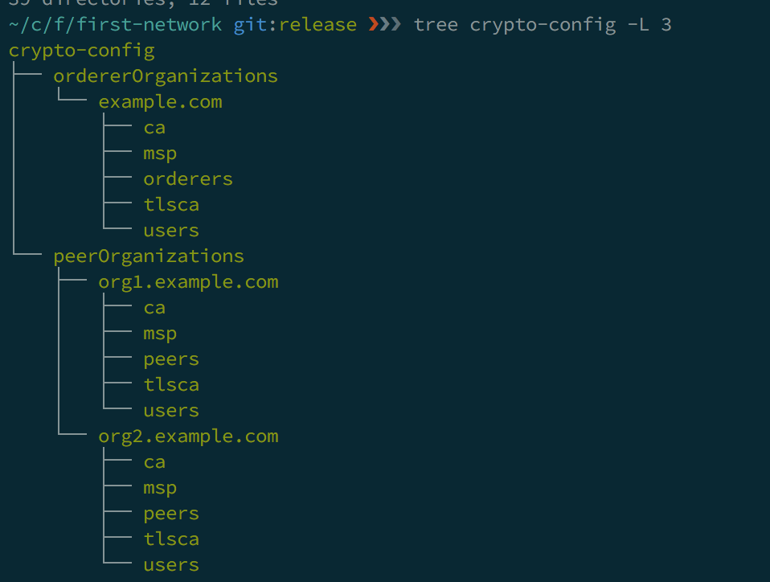
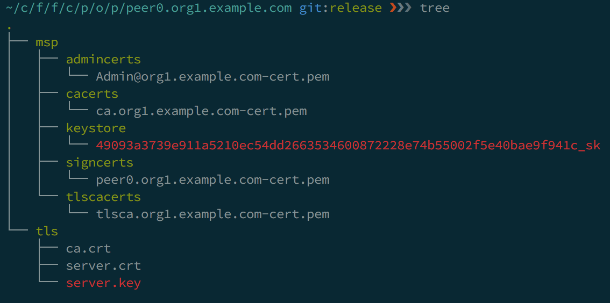
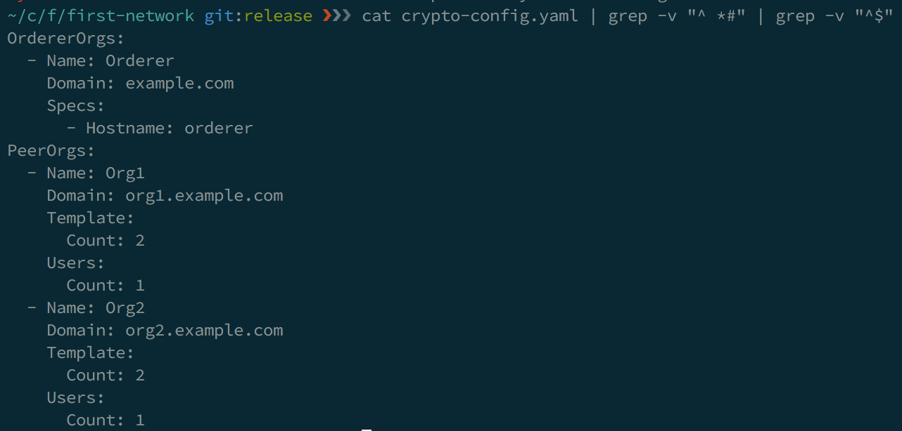
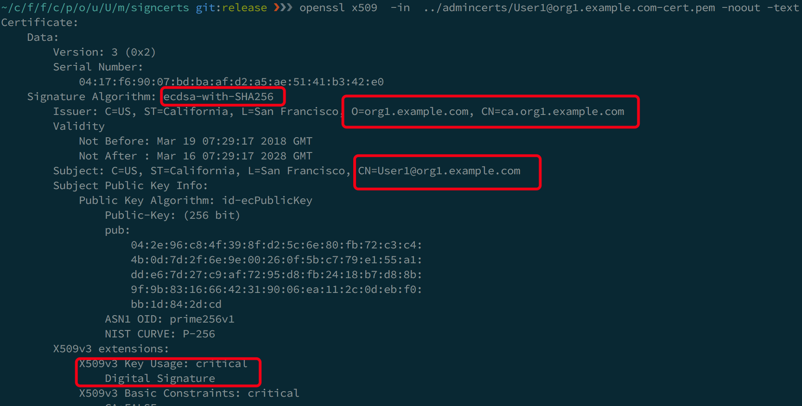
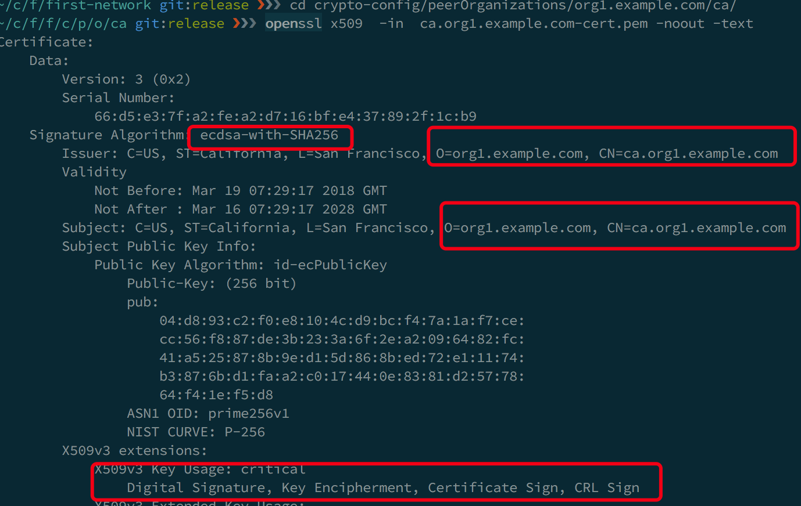

## 身份信息

权限管理是fabric很重要的一个功能, 有权限管理就要有身份的区别, 这个是根据组织, 成员类型或具体某个成员来区分, 底层是通过证书.

### 工具ctyptogen

Fabric 提供了一个工具-cryptogen 它会根据配置文件生成组织身份信息.
```shell
cryptogen generate --config=./crypto-config.yaml
```
byfn脚本对应的输出
```
/Users/haibbo/code/fabric-samples/first-network/../bin/cryptogen
 
##########################################################
##### Generate certificates using cryptogen tool #########
##########################################################
org1.example.com
org2.example.com
```

### 目录结构

创建的证书信息放在了crypto-config目录, 目录大概的结构如下:


crypto-config目录会有两个目录，ordererOrganizations和peerOrganizations，它们分别代表排序服务节点和Peer节点的MSP配置信息.
peerOrganizations目录下有两个组织 org1.example.com 和 org2.example.com，子目录结构同 ordererOrganizations 的 example.com.

目录 | 说明
------------ | -------------
ca | 根证书和密钥, pem为证书, sk为密钥
msp | 这个目录会共享给ordder或peer节点, 之后详细介绍
orderers或peers | 代表节点的配置
tlsca | tls ca的证书和密钥
user | 用户信息, 一定有一个管理员, 用户个数可指定

下面看下具体peer节点下都有什么:

MSP 目录结构如下:
目录 | 说明
------------ | -------------
admingcerts | MSP的管理员证书
cacerts | MSP的根证书
keystore| 签名的密钥
signcerts| 签名用的证书
tlscacerts| TLS的根证书

tls目录用来进行TLS连接, 保证链路层的安全, 结构如下 :
目录 | 说明
------------ | -------------
ca.crt | root CA 证书
cacerts | 用来进行TLS连接的证书
keystore| 用来TLS连接的密钥

如果仔细看crypto-config就会发现, 里面很多证书是重复的.应该是为了部署方便. 用下面的命令可以看到哪些证书是冗余的, 冗余文件的可能名字相同,也可能不相同.
```shell
find crypto-config -type f | xargs md5 | sort -k 4
```

### 配置文件

cryptogen使用的配置文件,crypto-config的内容如下:


- Hostname.Domain 是这个节点的全称
- Template 直接节点的个数, 隐式的hostname是peer[0-max]
- Users 指定普通用户个数, 管理员用户是默认存在的
- 用户和 peer 没有对应关系

### 证书信息

解析在org1.example.com里的user1的证书

- 签名为ECDSA, Hash算法为SHA256
- ca.org1.example.com签发
- 身份是User1@org1.example.com
- Key Usage: Digital Signature

你也可以查看签发用户的root ca,它是自签的.



### 这些证书已经生成, 会如何使用呢?
- 创世block
- copy到peer特定的目录里
- 客户端(SDK)需要用户证书, 去操作ledger
