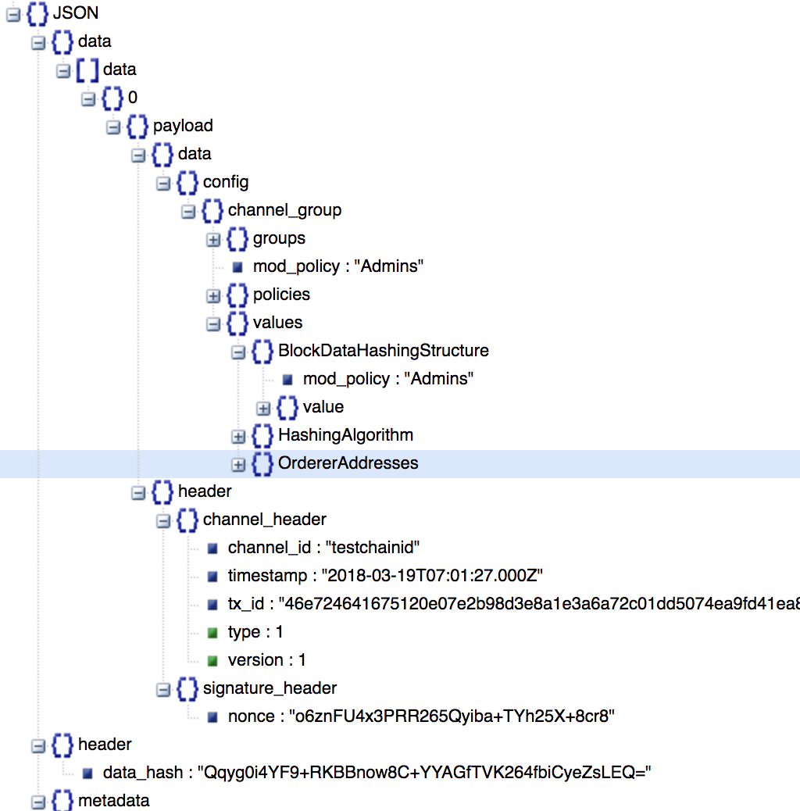
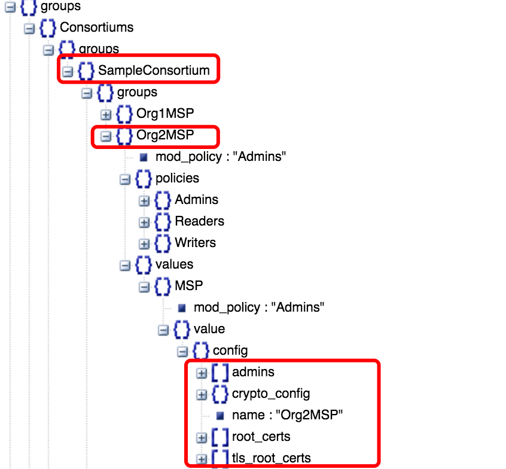
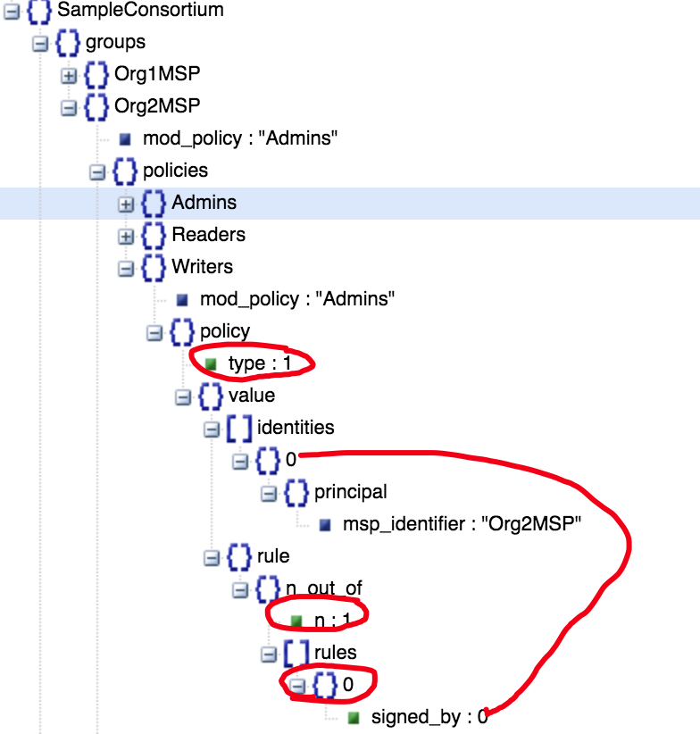
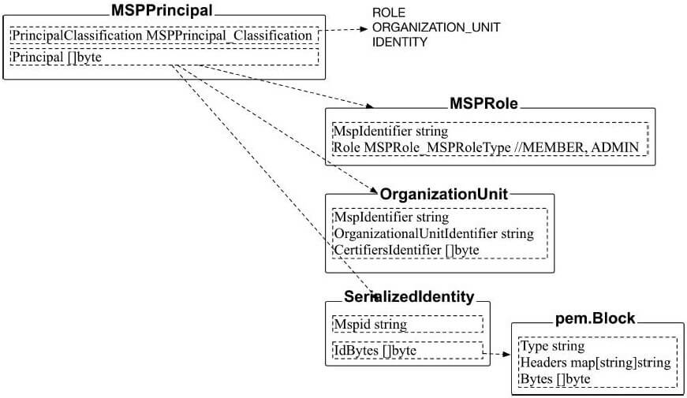

## 创世区块

它是区块链的第一个block,  Channel的第一个block是peer create channel时才创建的.

### 工具configtxgen

生成创世区块的的命令是:
```shell
configtxgen -profile TwoOrgsOrdererGenesis -outputBlock ./channel-artifacts/genesis.block
```
命令输出:
```
/Users/haibbo/code/fabric-samples/first-network/../bin/configtxgen
##########################################################
#########  Generating Orderer Genesis block ##############
##########################################################
2018-03-19 15:34:18.170 CST [common/configtx/tool] main -> INFO 001 Loading configuration
2018-03-19 15:34:18.233 CST [common/configtx/tool] doOutputBlock -> INFO 002 Generating genesis block
2018-03-19 15:34:18.236 CST [common/configtx/tool] doOutputBlock -> INFO 003 Writing genesis block
```

在未指定读取的配置文件路径, configtxgen会搜索本地路径下的configtx.yaml, 生成创世区块使用了Profile TwoOrgsOrdererGenesis.

### configtx.yaml

配置文件包含四个部分
- Profile: 指定了Orderer Consortiums Application ,Consortium. 具体内容由这些section组成
- Organizations: 包括名称、ID、MSP文件目录、管理员身份规则、锚节点, 结构如下:
```go
type Organization struct {
	Name           string `yaml:"Name"`
	ID                string `yaml:"ID"`
	MSPDir         string `yaml:"MSPDir"`
	AdminPrincipal string `yaml:"AdminPrincipal"`
	AnchorPeers []*AnchorPeer `yaml:"AnchorPeers"`
}
```
- Orderer: 包括类型、地址、块超时和限制、Kafka信息，支持的最大通道数、关联的组织信息等：
```go
type Orderer struct {
	OrdererType   string          `yaml:"OrdererType"`
	Addresses     []string        `yaml:"Addresses"`
	BatchTimeout  time.Duration   `yaml:"BatchTimeout"`
	BatchSize     BatchSize       `yaml:"BatchSize"`
	Kafka         Kafka           `yaml:"Kafka"`
	Organizations []*Organization `yaml:"Organizations"`
	MaxChannels   uint64          `yaml:"MaxChannels"`
}
```
- Application: 用户记录所关联的组织

如下命令可以dump出创世区块的内容, 除了配置文件指定的这些值外, 还有很多其他的值.
```shell
configtxgen -profile TwoOrgsOrdererGenesis -inspectBlock channel-artifacts/genesis.block
```
或通过configtxlator
```shell

```
结构如下:

三个子树, Group可以嵌套更多的树, Value和policies记录具体的数值.
所有的叶子节点都包括三个元素：   
- Value/Policy：记录所配置的内容数据结构
- ModPolicy：对该内容修改策略, 指定谁有权限修改.

上图的value子树, 记录了Hash算法、Orderer地址, 数据块Hash结构.

Poclicy子树记录了包括Readers、Writers、Admins三部分，分别规定了对链的读、写和管理者角色所指定的权限策略. 策略中规定了如何对签名来进行验证，以证明权限。

1：表示SIGNATURE，必须要匹配指定签名的组合；   
2：表示MSP，某MSP下的身份即可(未实现)
3：表示IMPLICIT_META，表示隐式的规则，该类规则需要对通道中所有的子组检查策略，并通过rule来指定具体的规则，包括ANY、ALL、MAJORITY三种：   
- ANY：满足任意子组的读角色；   
- ALL：满足所有子组的读角色；   
- MAJORITY：满足大多数子组的读角色.

Group->Consortiums->SampleConsortium结构如下:

- 联盟SampleConsortium又两个组织, Org1MSP和Org2MSP
- 每个组织下有policies 和value
- Value里面是admin, root 证书和tls root的证书, 可以拿来校验请求者的身份,
>- 是不是这个组织里面的
>- 是不是这个组织里的管理员


- type 1: SIGNATURE，必须要匹配指定签名的组合； 
- n_out_of 是满足下面rules的几条才匹配, 当前只有一条规则
- 第一个 rule是sign by 0, 这个0代表的是identities下的第一个principal, 此时它的要求是msp id 是Org2MSP, Principal 类型有三种, 当前例子里是0.
> - 0：表示基于实体的角色来进行判断，此时Principal值可以为Admin或Member，表示MSP中的管理员或成员角色；   
> - 1：表示基于实体所属的ORGANIZATION_UNIT进行判断，此时Principal值可以为指定的组织单元
> - 2：表示基于实体的身份来进行判断，此时Principal值可以为指定的实体。
> 


