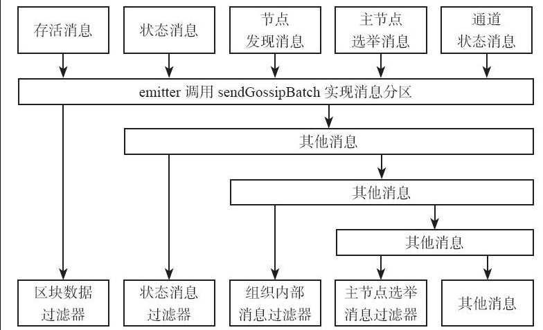

## Gossip - 消息广播和消息分区

对于需要广播的消息, gossip实现并不是有一条发一条, 需要先调用emmiter的add加入到队列中,积累到一定数量或超时时, 才发出.
emmiter模块具体的实现如下:
```go
type batchingemitterimpl struct {
	iterations int // 每个要广播的消息推送次数
	burstsize  int // 消息推送缓冲区大小
	delay      time.duration //消息推送的间隔
	cb         emitbatchcallback  // 真正发消息的函数, 消息分区处理就是在这个函数里面实现的
	lock       *sync.mutex
	buff       []*batchedmessage  // 存放要发送的消息
	stopflag   int32
}
type batchedmessage struct {
	data           interface{}     // 存储消息
	iterationsleft int             // 还需要发送几次
}
```
消息的发送有两个触发条件, 周期性的emit 或是 Add新消息时, 如果发现buff达到brustsize开始发送:
```go
func (p *batchingemitterimpl) add(message interface{}) {
    // 把新消息和配置的发送次数 存入buffer中
	p.buff = append(p.buff, &batchedmessage{data: message, iterationsleft: p.iterations})
    // 如果已存储的消息大于保存的最大消息数开始发送
	if len(p.buff) >= p.burstsize {
		p.emit()
	}
}
func (p *batchingemitterimpl) emit() {
    // 把消息复制出来, 因为锁的原因
    msgs2beemitted := make([]interface{}, len(p.buff))
		msgs2beemitted[i] = v.data
	}
    // 调用注册的callback函数
	p.cb(msgs2beemitted)
    // 减少消息的iterationsleft, 如果iterationsleft为0, 把消息从buffer中删除
	p.decrementcounters()
}
```
emmiter的初始化是在newgossipservice中:
```go
g.emitter = newbatchingemitter(conf.propagateiterations,
		conf.maxpropagationburstsize, conf.maxpropagationburstlatency,
		g.sendgossipbatch)
```
这里可以看到emmiter的callback函数是 sendgossipbatch, 在此函数中我们会调用partitionmessages对消息进行分区, 然后进行不同的逻辑处理:

```go
func partitionmessages(pred common.messageacceptor, a []*proto.signedgossipmessage) ([]*proto.signedgossipmessage, []*proto.signedgossipmessage) {
	s1 := []*proto.signedgossipmessage{}
	s2 := []*proto.signedgossipmessage{}
	for _, m := range a {
		if pred(m) {
			s1 = append(s1, m)
		} else {
			s2 = append(s2, m)
		}
	}
	return s1, s2
}
```
经过partitionmessages处理过的消息a，会分成两个切片，满足过滤器pre的放到切片s1中，不满足的放到切片s2中。
看下sendgossipbatch:
```go
func (g *gossipserviceimpl) gossipbatch(msgs []*proto.signedgossipmessage) {

	isablock := func(o interface{}) bool {
		return o.(*proto.signedgossipmessage).isdatamsg()
	}
	isastateinfomsg := func(o interface{}) bool {
		return o.(*proto.signedgossipmessage).isstateinfomsg()
	}
	..........................
	// 用gossipinchan对所有的blocks消息进行处理
	// 这里的路由策略, 是用来筛选目标节点的
	blocks, msgs = partitionmessages(isablock, msgs)
	g.gossipinchan(blocks, func(gc channel.gossipchannel) filter.routingfilter {
		return filter.combineroutingfilters(gc.eligibleforchannel, gc.ismemberinchan, g.isinmyorg)
	})
	........................
	
	// 广播 StateInfo 消息
	stateInfoMsgs, msgs = partitionMessages(isAStateInfoMsg, msgs)
	for _, stateInfMsg := range stateInfoMsgs {
	    // 相同组织的过滤器
		peerSelector := g.isInMyorg
		gc := g.chanState.lookupChannelForGossipMsg(stateInfMsg.GossipMessage)
		if gc != nil && g.hasExternalEndpoint(stateInfMsg.GossipMessage.GetStateInfo().PkiId) {
	        // 如果你有设置endternalEndpoint你需要和组织外的设备沟通, 过滤规则就变成了同一个channel
			peerSelector = gc.IsMemberInChan
		}
		peers2Send := filter.SelectPeers(g.conf.PropagatePeerNum, g.disc.GetMembership(), peerSelector)
		g.comm.Send(stateInfMsg, peers2Send...)
	}
	...................
}
```

分区消息过滤器漏斗:

