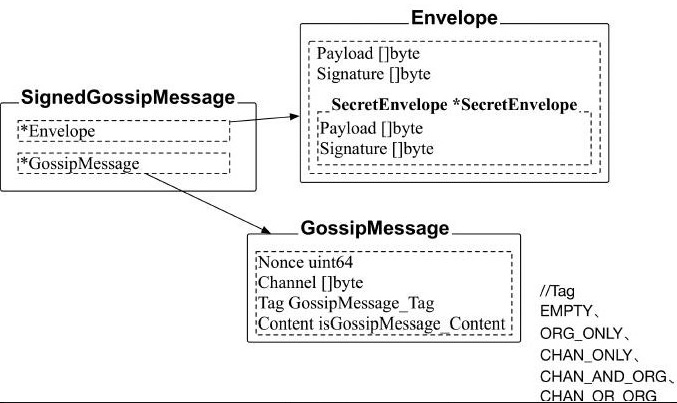

## Gossip - 消息类型

Peer节点之间可以通过Gossip协议来完成区块分发、状态同步等过程，主要过程为通过GossipClient客户端的Gossip-Stream双向流进行通信，发送SignedGossipMessage消息结构。相关定义在protos/gossip/message.proto文件中，gRPC服务地址主要为/gossip.Gossip/GossipStream。 

### SignedGossipMessage消息结构:

#### GossipMessage_Tag:

Tag成员的值决定了消息可以在哪种范围内传播，有以下几种值：

- UNDEFINED 		- 未定义
- EMPTY 			- 空，对应上文章节2.1中的EMPTY消息
- ORG_ONLY 		- 只在同一组织内传播
- CHAN_ONLY 	        - 只在同一频道内传播
- CHAN_AND_ORG  - 同时在同一频道和同一组织内传播
- CHAN_OR_ORG     - 既可以在同一频道内，也可以在统一组织内传播

#### isGossipMessage_Content

isGossipMessage_Content是一个接口, 所有的消息类型都实现了这个接口. 获取具体消息的时候, 通过反射就可以得到具体的消息.

### 消息的分类

#### 辅助类消息

之所以叫辅助类消息，是这类消息不承担具体传送传播数据的任务，而是辅助性的：

- Empty		   - 空消息. 用于结点间的Ping（来测试结点是否连通）和测试。
- ConnEstablish - 建立连接消息. 用于握手，在任何时候一个peer想与另一个peer连接通信都需要通过这个消息来传递自己的证书, 之后的连接都会通过证书来校验消息的合法性.

#### 推拉消息

用于pull机制中处理的消息类型。所谓pull机制，就是一个结点主动向其他结点索要自己需要的消息（数据），pull进（即拉进，拽进的意思）自己的结点中处理或存储，整个pull过程需要四步，每个步骤需要一种消息：

- GossipHello   - hello消息 用于和节点初始化新一轮的pull
- DataDigest     - 消息摘要
- DataRequest  - 摘要请求
- DataUpdate   - 摘要应答

####  状态消息

和状态有关的消息。这里的状态指的是chain的数据状态，如一个结点所存储的块数据是否一致，可以说这里所谓的状态接近数据的意思。

- DataMessage 	      - 数据消息
- StateInfo                      - 状态消息, 用于传播自己的状态给别的节点
- StateInfoSnapshot     - 状态快照消息（即一组StateInfo消息）
- StateInfoPullRequest - 状态请求消息, 用于获取StateInfoSnapshot消息
- StateRequest               - 用于从远端节点哪里获取一组Blocks
- StateResponse            - 用于发送一组Blocks 给远端节点

#### 成员消息

- AliveMessage 		- alive消息, 用于通知别的节点自己的存在和存活
- MembershipRequest   - 成员关系请求消息, 从别的节点要成员信息
- MembershipResponse -成员关系应答消息,  回复MembershipRequest , 带上存活和死亡的节点切片

#### 选举和身份消息

- LeadershipMessage - 选举消息, 在选择过程中通知其他节点自己想成为leader或声明自己已经为leader
- PeerIdentity               - 身份消息 它可以使节点知道某个固定节点的身份信息