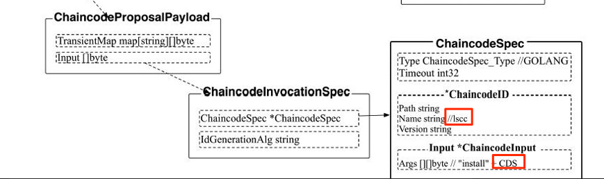

## 安装ChainCode

### 客户端

客户端使用如下命令安装ChainCode

```shell
peer chaincode install -n mycc -v 1.0 -p github.com/hyperledger/fabric/examples/chaincode/go/chaincode_example02
```

客户端构建一个Signed Proposal, PayLoad如下:



ChaincodeSpec结构中:

- Type为ChaincodeSpec_GOLANG

- ChaincodeId.Name为“lscc”, 

- Inpu 为“install” + ChaincodeDeploymentSpec. 

通过gRPC发送给Peer的ProcessProposal, 安装只和Peer有交互.

ChaincodeDeploymentSpec结构:

```go
type ChaincodeDeploymentSpec struct {    
    // 链码描述规范    
    ChaincodeSpec *ChaincodeSpec    
    // 控制链码可用事件，预留字段    
    EffectiveDate *google_protobuf1.Timestamp    
    // 打包好的链码代码    
    CodePackage   []byte    
    // 运行环境, 当前只支持系统进程和Docker    
    ExecEnv       ChaincodeDeploymentSpec_ExecutionEnvironment
}
//代码在protos/peer/chaincode.pb.go
```

### Peer LSCC(生命周期管理系统链码)

生命周期管理系统链码（Lifecycle System Chaincode,LSCC），主要功能是管理部署在背书节点上的链码.

LSCC Invoke 安装部分代码:

```go
case INSTALL:
		// 检查安装Propsal中的签名是否为某个MSP的Admin身份
		lscc.policyChecker.CheckPolicyNoChannel(mgmt.Admins, sp)
		// 安装
		err := lscc.executeInstall(stub, depSpec)
		// 返回, 上层会返回给客户端Proposal Response
		return shim.Success([]byte("OK"))
//代码在core/scc/lscc/lscc.go
```

executeInstall:

```go
	// 获取ChaincoDeploymentSpec
    ccpack, err := ccprovider.GetCCPackage(ccbytes)
	cds := ccpack.GetDepSpec()
	// 判断ChainCode的名字是否合法
	err = lscc.isValidChaincodeName(cds.ChaincodeSpec.ChaincodeId.Name)
	// 判断ChainCode的版本是否合法
	err = lscc.isValidChaincodeVersion(cds.ChaincodeSpec.ChaincodeId.Name, 			cds.ChaincodeSpec.ChaincodeId.Version)
	// 把链码写到文件系统里面
	if err = ccpack.PutChaincodeToFS();
//代码在core/scc/lscc/lscc.go
```

- 名字 allowedCharsChaincodeName = "[A-Za-z0-9_-]+"
- 版本 allowedCharsVersion       = "[A-Za-z0-9_.-]+"
- 链码保存到了 ls /var/hyperledger/production/chaincodes/mycc.1.0
- ChaincodeDeploymentSpec 结构


