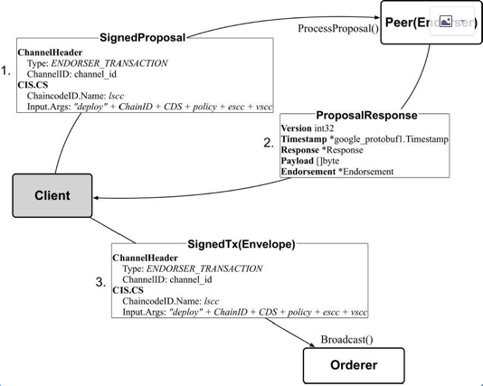

## 实例化链码 - 客户端

### 客户端命令如下:

```shell
peer chaincode instantiate -o orderer.example.com:7050 -C mychannel -n mycc -v 1.0 -c '{"Args":["init","a","100","b","200"]}' -P "OR ('Org1MSP.member','Org2MSP.member')"
```
- 在指定通道上对安装过的链码进行实例化, 链码在实例化之前是和通道无关的, 实例化的时候才绑定通道.
- 需提供初始化参数, 节点会创建容器, 并调用链码的 Init 方法进行初始化操作
- 实例化链码过程会与 Orderer 和 Peer 节点打交道
- 执行实例化的用户,必须有在此通道上的 Write 权限, 默认是Admin
- 实例化可以指定背书策略,  上面例子的背书策略是, 组织1或组织2的任何一个 member
- 链码实例化后进入 ready 状态.

### 链码实例化过程



### 客户端实现

代码在peer/chaincode/instantiate.go

```go
func instantiate(cmd *cobra.Command, cf *ChaincodeCmdFactory) (*protcommon.Envelope, error) {
    // 从命令行获取ChaincodeSpec
	spec, err := getChaincodeSpec(cmd)
	// 获取ChaincodeDeploymentSpec, 主要填充了chaincode的code package
	cds, err := getChaincodeDeploymentSpec(spec, false)
	
	creator, err := cf.Signer.Serialize()
	// 创建Proposal
	prop, _, err := utils.CreateDeployProposalFromCDS(chainID, cds, creator, 
	// 根据签名者信息, 生成SignedProposal
	var signedProp *pb.SignedProposal
	signedProp, err = utils.GetSignedProposal(prop, cf.Signer)
	// 发送ProcessProposal 给背书节点 等待response
	proposalResponse, err := cf.EndorserClient.ProcessProposal(context.Background(), signedProp)
	
	// 根据Response里的读写集, 签名, 生成Tx Envelope, 之后由chaincodeDeploy 发给orderer节点
	env, err := utils.CreateSignedTx(prop, cf.Signer, proposalResponse)

	return env, nil
}
```

