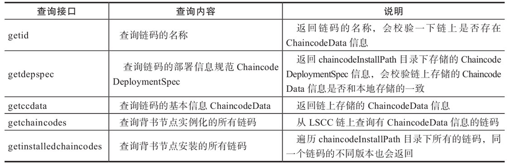

## 实例化链码 - 生命周期管理系统链码(LSCC)

Lifecycle System Chaincode，主要功能是管理, 部署背书节点上的链码.

除了之前介绍的Install, 还支持

- 链码实例化

- 链码升级

- 链码信息查询

  

### 实例化

LSCC 的 Invoke 处理客户端发过来的 SignedProposal, 如果 Input.Args 是 "deploy", LSCC 会调用 executeDeploy 执行链码实例化.

用户链码相关的代码都在 core/chaincode 路径下. 其中 core/chaincode/shim 的代码主要是供链码容器侧使用，其它代码主要是 Peer 侧使用. 

```go
func (lscc *LifeCycleSysCC) executeDeploy(stub shim.ChaincodeStubInterface, chainname string, depSpec []byte, policy []byte, escc []byte, vscc []byte) (*ccprovider.ChaincodeData, error) {
	// 获取Signed Proposal中的CDS
	cds, err := utils.GetChaincodeDeploymentSpec(depSpec)
    
	// 检查名字和版本, 和Install时类似.
	lscc.isValidChaincodeName(cds.ChaincodeSpec.ChaincodeId.Name)
	err = lscc.isValidChaincodeVersion(cds.ChaincodeSpec.ChaincodeId.Name, cds.ChaincodeSpec.ChaincodeId.Version)
	// 做账号访问控制, 当前的实现是空
	err = lscc.acl(stub, chainname, cds)

	// 检测这个chaincode是否已经在LSCC中存在(实例化过) 会调用GetState试图从链上获取ChaincodeData
	_, err = lscc.getCCInstance(stub, cds.ChaincodeSpec.ChaincodeId.Name)

	// 从文件系统中读出chaincode, 返回CDSPackage
	ccpack, err := ccprovider.GetChaincodeFromFS(cds.ChaincodeSpec.ChaincodeId.Name, cds.ChaincodeSpec.ChaincodeId.Version)
	
	// 生成ChiancodaData 并配置ESCC, VSCC 和背书策略
	cd := ccpack.GetChaincodeData()
	cd.Escc = string(escc)
	cd.Vscc = string(vscc)
	cd.Policy = policy

	// 获取实例化策略并用它evalutate 
	cd.InstantiationPolicy, err = lscc.getInstantiationPolicy(chainname, ccpack)
	err = lscc.checkInstantiationPolicy(stub, chainname, cd.InstantiationPolicy)
	// 基于chaindata进行实例化
	err = lscc.createChaincode(stub, cd)
	return cd, err
}
//代码在core/scc/lscc/lscc.go
```

createChaincode 函数会调用 putChaincodeData, 之后它会调用PutState.

PutState是账本提供一个API, 用于添加或更新一对 Key-value, 这对键值会被放到读写集中, 等待Committer验证后写到账本中.

实例化链码, 要往账本里写入什么呢? 存入的是 ChaincodeData

```go
func (lscc *LifeCycleSysCC) putChaincodeData(stub shim.ChaincodeStubInterface, cd *ccprovider.ChaincodeData) error {
	.......
	cdbytes, err := proto.Marshal(cd)
    // stub.PutState 最终会调用到core/chaincode/shim/handler.go中的 handlePutState
	err = stub.PutState(cd.Name, cdbytes)

	return err
}
//代码在core/scc/lscc/lscc.go 
```

ChaincodeData的定义如下:

```go
type ChaincodeData struct {    
    // 链码名称   
    Name string    
    // 链码版本    
    Version string    
    // 链码的ESCC，默认是内置的escc
     Escc string    
    // 链码的VSCC，默认是内置的vscc    
    Vscc string    
    // 链码的背书策略    
    Policy []byte    
    // 链码源代码哈希和元数据哈希组成的
    CDSData    Data []byte    
    // 链码编号，预留字段    
    Id []byte    
    // 链码实例化策略    
    InstantiationPolicy
}
type CDSData struct {    
    // 链码源代码哈希=hash(chaincode)    
    CodeHash []byte    
    // 链码元数据哈希=hash(chaincodeName+chaincodeVersion)    
    MetaDataHash []byte}
}
```

以链码名为Key, ChaincodeData为value, 写到模拟器里.

