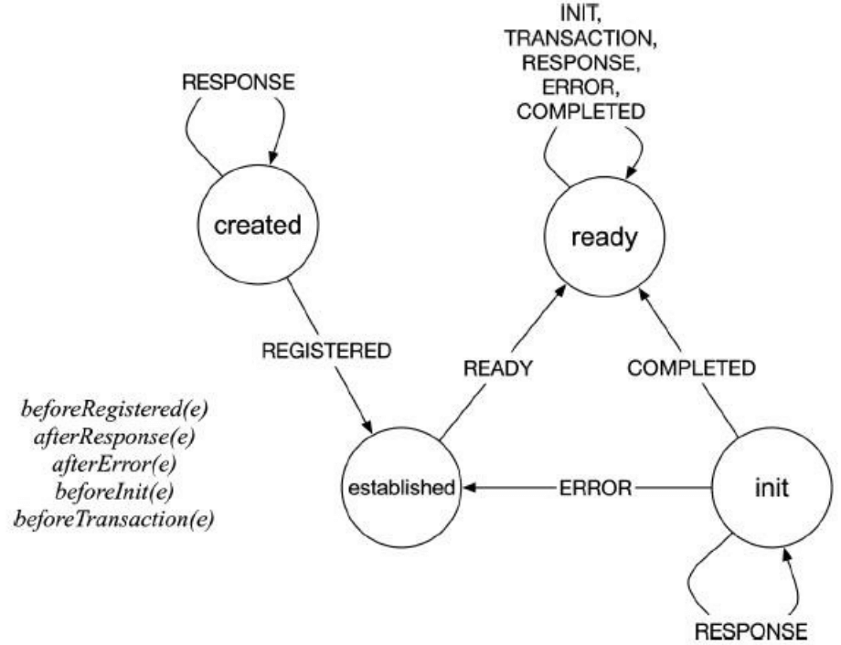
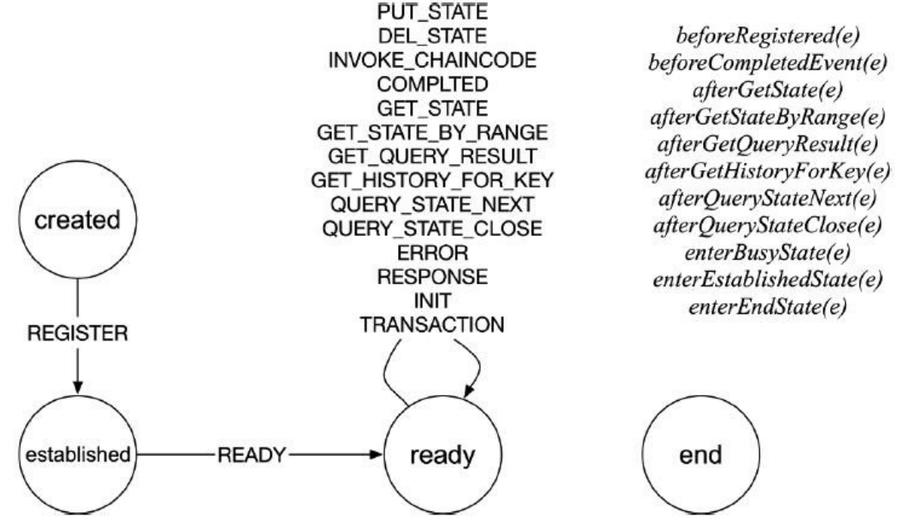
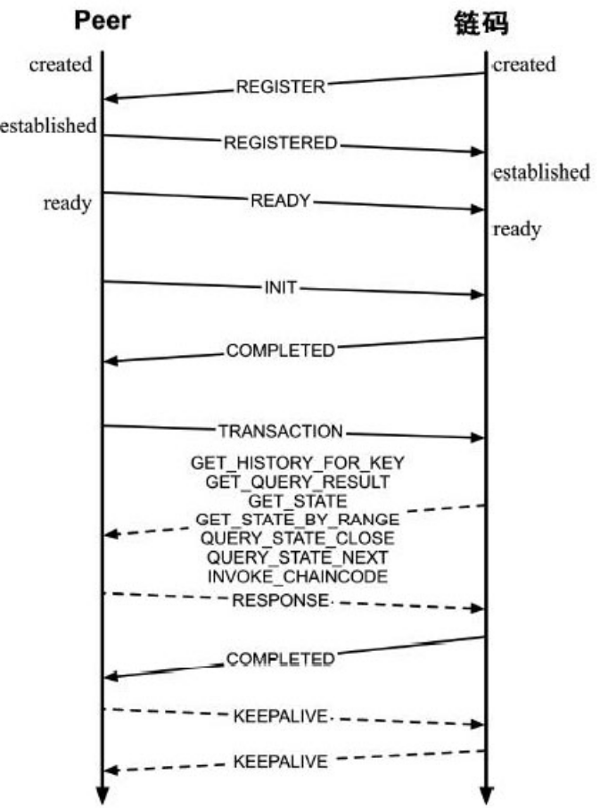

## 实例化链码 - 链码状态机

链码是无状态的, 不会存储任何数据, 因此多个 channel 可以共享同一个链码. 业务逻辑处理过程中是通过建立好的gRPC 连接实现和背书节点的交互，交互API由 shim.ChaincodeSubInterface 定义, 交互过程是通过有限状态机（Finite State Machine）来实现的. 当前Fabric 采用了github.com/looplab/fsm 实现链码的逻辑处理.

[looplab/fsm文档](https://godoc.org/github.com/looplab/fsm) 

### 链码测状态机

下面是链码侧状态机的一个例子:

```go
v.FSM = fsm.NewFSM(
	"created", //初始状态created
	fsm.Events{ 
    // 收到event, 从 created 状态进入 established 状态
	{Name: pb.ChaincodeMessage_REGISTERED.String(), Src: []string{"created"}, Dst: "established"},
	{Name: pb.ChaincodeMessage_READY.String(), Src: []string{"established"}, Dst: "ready"},
	{Name: pb.ChaincodeMessage_ERROR.String(), Src: []string{"init"}, Dst: "established"},
	{Name: pb.ChaincodeMessage_RESPONSE.String(), Src: []string{"init"}, Dst: "init"},
......................................
	},
	fsm.Callbacks{
        // before_<EVENT> - called before event named <EVENT>
        // after_<EVENT> - called after event named <EVENT>
        // 在处理 event REGISTERED 之前调用
		"before_" + pb.ChaincodeMessage_REGISTERED.String():  func(e *fsm.Event) { v.beforeRegistered(e) },
        // 在处理完 event RESPONSE 之后调用
		"after_" + pb.ChaincodeMessage_RESPONSE.String():     func(e *fsm.Event) { .................
		},
)
// 代码在core/chaincode/shim/handle.go
```

状态机用图表示会很清楚. 根据下图, 你可以看到

- 状态在什么情况下做切换
- event/state注册的函数列表



### Peer 端状态机

 代码在core/chaincode/handle.go, 这里不再列出.



### 链码消息交互

两者通过ChaincodeMessage消息进行交互.

根据两者的状态机, 交互图如下:

这个图有点问题, established 和 ready 之间还有一个init 状态,  edatblished 收到 READY 会进入 init 状态, 在链码init成功后, 会给自己发送 COMPLETED, 然后进入ready状态.

