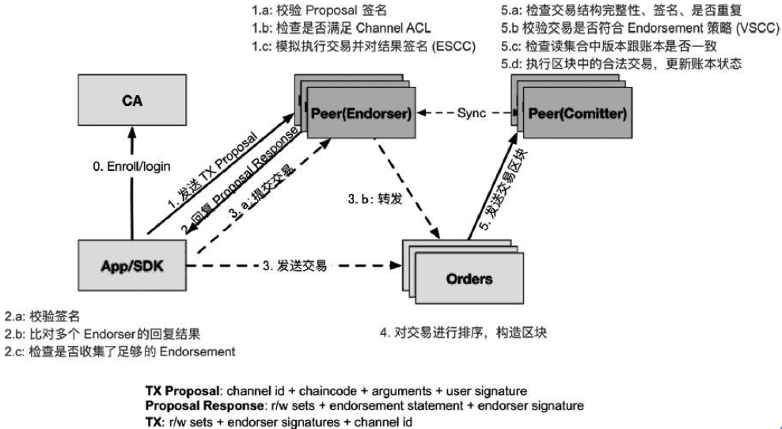

## 交易流程(链码调用)

### 流程

交易流程如下图, 涉及到了所有角色, 依次分析不同的角色做的工作.

当前CA并没有实现T-Cert, 所以只负责初期证书的分配, 不参与到具体交易中, 并且这个BYFN没有使用CA就忽略了.

## Log文件

[peer0.org1.log](logs/invoke.peer0.org1.log)

[peer1.org1.log](logs/invoke.peer1.org1.log)

[orderer.log](logs/invoke.orderer.log)