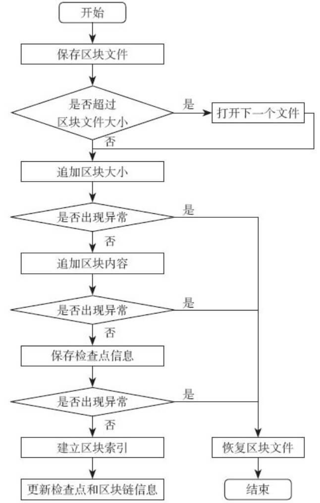

## 交易流程 - 添加区块

添加区块的过程会更新Index DB, 更新检查点信息, 如果失败根据之前的检查点信息恢复区块内容.

### 流程图 




### 代码

添加区块，区块写入文件，索引区块.

func (mgr *blockfileMgr) addBlock(block *common.Block) error

```go

//序列化区块，返回序列化后字节，以及serializedBlockInfo（含BlockHeader和交易索引信息）
blockBytes, info, err := serializeBlock(block)
blockHash := block.Header.Hash() //blockHash
txOffsets := info.txOffsets //交易索引信息
currentOffset := mgr.cpInfo.latestFileChunksize //最新的区块文件大小
blockBytesLen := len(blockBytes)
blockBytesEncodedLen := proto.EncodeVarint(uint64(blockBytesLen)) //blockBytesLen
totalBytesToAppend := blockBytesLen + len(blockBytesEncodedLen) //blockBytesLen + blockBytesEncodedLen

if currentOffset+totalBytesToAppend > mgr.conf.maxBlockfileSize { //超出文件大小限定，创建新文件
	mgr.moveToNextFile()
	currentOffset = 0
}
err = mgr.currentFileWriter.append(blockBytesEncodedLen, false) //追加写入blockBytesLen
if err == nil {
	err = mgr.currentFileWriter.append(blockBytes, true) //追加写入blockBytes
}
if err != nil { 
    //追加写入失败，恢复
	truncateErr := mgr.currentFileWriter.truncateFile(mgr.cpInfo.latestFileChunksize)
	return fmt.Errorf("Error while appending block to file: %s", err)
}

currentCPInfo := mgr.cpInfo
newCPInfo := &checkpointInfo{
	latestFileChunkSuffixNum: currentCPInfo.latestFileChunkSuffixNum,
	latestFileChunksize:      currentCPInfo.latestFileChunksize + totalBytesToAppend,
	isChainEmpty:             false,
	lastBlockNumber:          block.Header.Number}
if err = mgr.saveCurrentInfo(newCPInfo, false); err != nil { //更新检查点信息
    //更新失败，恢复区块文件
	truncateErr := mgr.currentFileWriter.truncateFile(currentCPInfo.latestFileChunksize) 
	return fmt.Errorf("Error while saving current file info to db: %s", err)
}

blockFLP := &fileLocPointer{fileSuffixNum: newCPInfo.latestFileChunkSuffixNum}
blockFLP.offset = currentOffset
for _, txOffset := range txOffsets {
	txOffset.loc.offset += len(blockBytesEncodedLen) //更新文件交易指针
}
mgr.index.indexBlock(&blockIdxInfo{ // 建立索引
	blockNum: block.Header.Number, blockHash: blockHash,
	flp: blockFLP, txOffsets: txOffsets, metadata: block.Metadata})

mgr.updateCheckpoint(newCPInfo) //更新检查点信息
mgr.updateBlockchainInfo(blockHash, block) //更新BlockchainInfo
return nil
//代码在common/ledger/blkstorage/fsblkstorage/blockfile_mgr.go
```

