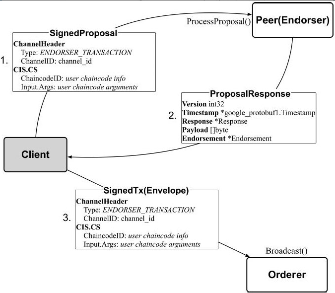

## 交易流程 - 客户端

### 客户端命令:

```shell
setGlobals 0
peer chaincode invoke -o orderer.example.com:7050 -C mychannel -n mycc -c '{"Args":["invoke","a","b","10"]}'
```

### 流程

和链码实例化类似就不分析代码了, 流程如下图:

- ChannelID: mychannel
- ChaincodeID: mycc
- Input Args: ["invoke","a","b","10"]


