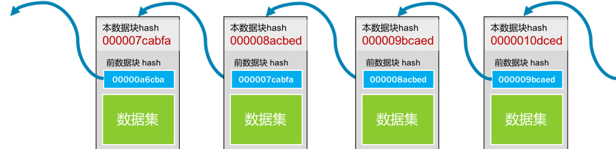

## 交易流程 - 区块链

区块链就像一个单向链表, 一个数据块中至少保存着三个信息.

- 真正的数据
- 自己的地址(或是 ID)
- 前一个数据块的地址

这样, 通过追溯前一个块的地址, 把所有的数据块存成了一条链. 所以, 我们叫其 BlockChain. 如下图所示. 

对于第一块数据, 我们把其 " 数据集 " 和 " 前数据块的 hash 值 00000a6cba" 一起做 hash 值, 得到本区块的地址 000007cabfa. 然后, 下一个区块会把自己的数据和 000007cabfa 一起做 hash, 得到 000008acbed 这个哈希值……如此往复下去. 

根据 " 被 hash 的数据中有一个 bit 被修改了, 整个 hash 就完全不一样了 " 这个特性, 我们知道：

- 如果前置数据块中的数据改了, 那么其 hash 就会完全不一样了, 也就是说你的 ID 或地址就变了, 于是别人就找不到这个数据块了；
- 所以, 你还要去修改别人数据块中指向你的地址, 但是别人数据块中指向你的地址(ID/hash)变了, 也会导致他自己的地址(ID/hash)随之变化. 因为他用你的地址生成了自己的地址, 这样一来, 你就需要把其他人的地址全部改掉. 

在这样的连锁反应下, 你想要偷偷修改一个 bit 的难度一下就提高很多. 所以, 在区块链的世界里, 越老的区块越安全也越不容易被人篡改, 越新的区块越不安全也越容易被人篡改. 