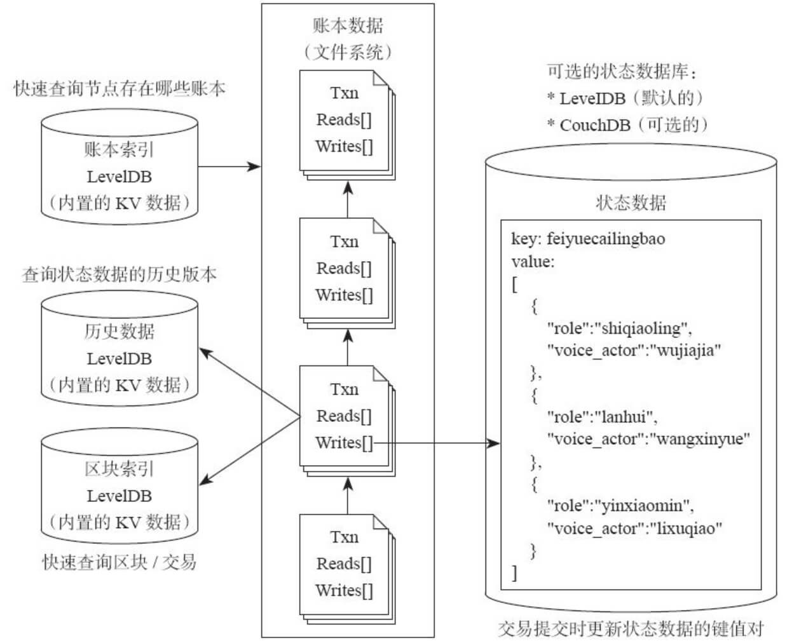

##   交易流程 - 数据存储

HyperLedger中数据存数分为一个账本和4个DB.

账本数据就是区块链结构, 只能增加不能修改是信任的来源.

4个DB是:

- State DB:                 存储最新的世界状态数据
- Block Index DB:     区块索引, 用于快速查询区块/交易
- History IndexDB:   存储key的版本变化
- idStore DB:             用户快速查询这个Peer有那些账本；

### 数据在文件系统中

通过`docker exec -it peer0.org1.example.com sh` 进入peer.

```shell
# find /var/hyperledger/production/ledgersData
/var/hyperledger/production/ledgersData
/var/hyperledger/production/ledgersData/chains/chains/mychannel/blockfile_000000
/var/hyperledger/production/ledgersData/chains/index
/var/hyperledger/production/ledgersData/stateLeveldb
/var/hyperledger/production/ledgersData/historyLeveldb
/var/hyperledger/production/ledgersData/ledgerProvider
```

### 结构图

