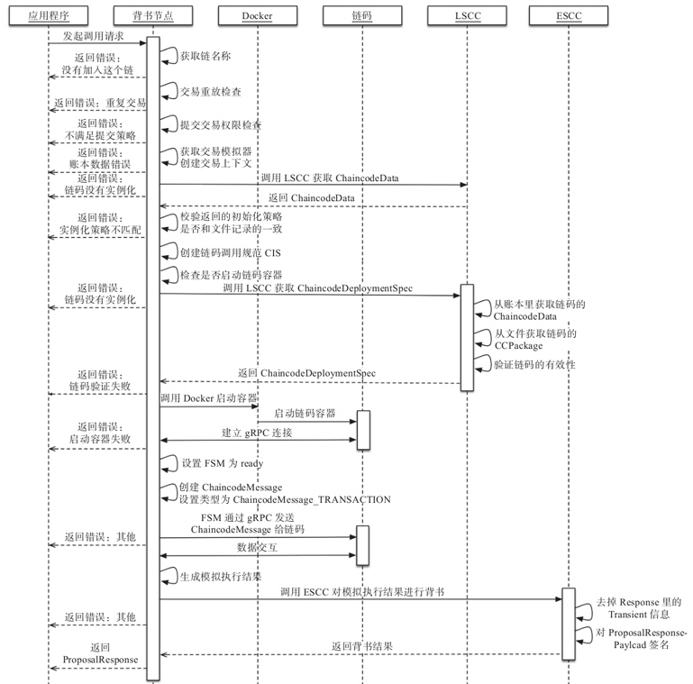

## 交易流程 - 背书节点

### 流程



### 实现

#### ProcessProposal

```go
func (e *Endorser) ProcessProposal(ctx context.Context, signedProp *pb.SignedProposal) (*pb.ProposalResponse, error) {
	endorserLogger.Debugf("Entry")
	defer endorserLogger.Debugf("Exit")
	// 校验消息的合法性, 并从消息中获取Proposal, Header, ChannelHeader 等
	prop, hdr, hdrExt, err := validation.ValidateProposalMessage(signedProp)
	chdr, err := putils.UnmarshalChannelHeader(hdr.ChannelHeader)
	shdr, err := putils.GetSignatureHeader(hdr.SignatureHeader)


	// 判断是否在调用一个不允许外部调用的系统链码
	if syscc.IsSysCCAndNotInvokableExternal(hdrExt.ChaincodeId.Name) {
		return &pb.ProposalResponse{Response: &pb.Response{Status: 500, Message: err.Error()}}, err
	}

	chainID := chdr.ChannelId

	// Check for uniqueness of prop.TxID with ledger
	// Notice that ValidateProposalMessage has already verified
	// that TxID is computed properly
	txid := chdr.TxId
	if txid == "" {
		err = errors.New("Invalid txID. It must be different from the empty string.")
		return &pb.ProposalResponse{Response: &pb.Response{Status: 500, Message: err.Error()}}, err
	}
	endorserLogger.Debugf("processing txid: %s", txid)

	// 对应的channel有没有创建, 创建了就有账本
	lgr := peer.GetLedger(chainID)

    // 是否是重复交易
	_, err := lgr.GetTransactionByID(txid)

	// check ACL only for application chaincodes; ACLs
	// for system chaincodes are checked elsewhere
	if !syscc.IsSysCC(hdrExt.ChaincodeId.Name) {
		// check that the proposal complies with the channel's writers
		 err = e.checkACL(signedProp, chdr, shdr, hdrExt)
	}
	
	var txsim ledger.TxSimulator
	var historyQueryExecutor ledger.HistoryQueryExecutor
	if chainID != "" {
        // 获取交易模拟器
		txsim, err = e.getTxSimulator(chainID)
        // 查询history DB的接口, 链码容器API: GET_HISTORY_FOR_KEY, BYFN并没有使用.
		historyQueryExecutor, err = e.getHistoryQueryExecutor(chainID)
		ctx = context.WithValue(ctx, chaincode.HistoryQueryExecutorKey, historyQueryExecutor)

		defer txsim.Done()
	}

	// 模拟交易
	cd, res, simulationResult, ccevent, err := e.simulateProposal(ctx, chainID, txid, signedProp, prop, hdrExt.ChaincodeId, txsim)

	// 调用ESCC 开始背书, 并返回 ProposalResponse 消息
	var pResp *pb.ProposalResponse
	pResp, err = e.endorseProposal(ctx, chainID, txid, signedProp, prop, res, simulationResult, ccevent, hdrExt.PayloadVisibility, hdrExt.ChaincodeId, txsim, cd)

	pResp.Response.Payload = res.Payload

	return pResp, nil
}
```

#### simulateProposal

```go
func (e *Endorser) simulateProposal(ctx context.Context, chainID string, txid string, signedProp *pb.SignedProposal, prop *pb.Proposal, cid *pb.ChaincodeID, txsim ledger.TxSimulator) (*ccprovider.ChaincodeData, *pb.Response, []byte, *pb.ChaincodeEvent, error) {
	// 获取ChaincodeInvocationSpec, 当前只支持CIS
	cis, err := putils.GetChaincodeInvocationSpec(prop)
	// 通过LSCC 获取账本中的ChaincodeData
	cdLedger, err = e.getCDSFromLSCC(ctx, chainID, txid, signedProp, prop, cid.Name, txsim)
	version = cdLedger.Version
    // 账本中的实例化策略和cache中的实例化策略进行对比. 为什么?
	err = ccprovider.CheckInsantiationPolicy(cid.Name, version, cdLedger)
	// 执行提案
	res, ccevent, err = e.callChaincode(ctx, chainID, version, txid, signedProp, prop, cis, cid, txsim)

	// 获取模拟结果
	simResult, err = txsim.GetTxSimulationResults()

	return cdLedger, res, simResult, ccevent, nil
}
```

#### callChaincode

 参考下节

